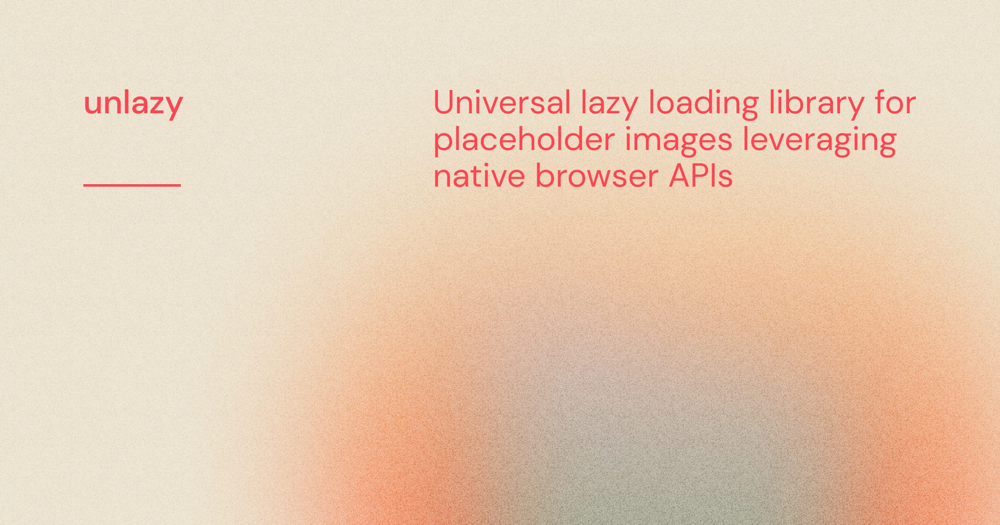

[](https://unlazy.byjohann.dev)

# unlazy

[![npm version][npm-version-src]][npm-version-href]
[![bundle][bundle-src]][bundle-href]

Universal lazy loading library leveraging native browser APIs. Built around the `loading="lazy"` attribute, with [BlurHash](https://unlazy.byjohann.dev/placeholders/hash-based#blurhash) / [ThumbHash](https://unlazy.byjohann.dev/placeholders/hash-based#thumbhash) placeholders, a dedicated above-the-fold priority path, and a dev-mode LCP warning so you never ship a lazy-loaded hero image by accident.

## Features

- 🎀 **Native**: Utilizes the `loading="lazy"` attribute
- 🎛️ **Framework-agnostic**: Works with any framework or no framework at all
- 🌊 **BlurHash & ThumbHash support**: SSR & client-side [BlurHash](https://blurha.sh) and [ThumbHash](https://github.com/evanw/thumbhash) decoding
- ⚡ **Core Web Vitals-aware**: Eager-priority path for above-the-fold images, dev-mode LCP warning
- 🪄 **Sizing**: Automatically calculates the `sizes` attribute
- 🔍 **SEO-friendly**: Detects search engine bots and preloads all images
- 🎟 **`<picture>`**: Supports multiple image tags
- 🏎 **Auto-initialize**: Usable without a build step

## Setup

> [📖 Read the documentation](https://unlazy.byjohann.dev)

```bash
# pnpm
pnpm add -D unlazy

# npm
npm i -D unlazy
```

## Basic Usage

To apply lazy loading to all matching images, import the [`lazyLoad`](https://unlazy.byjohann.dev/api/lazy-load) function and call it without any arguments:

```ts
import { lazyLoad } from 'unlazy'

// Processes `img[loading="lazy"]` and `img[loading="eager"][data-src|data-srcset]`
lazyLoad()
```

For above-the-fold images (your hero / LCP image), use `loading="eager"`. unlazy swaps the real source immediately and applies `fetchpriority="high"` for you:

```html

```

You can target specific images by passing a CSS selector, a DOM element, a list of DOM elements, or an array of DOM elements to lazy-load to [`lazyLoad`](https://unlazy.byjohann.dev/api/lazy-load).

## 💻 Development

1. Clone this repository
2. Enable [Corepack](https://github.com/nodejs/corepack) using `corepack enable`
3. Install dependencies using `pnpm install`
4. Run `pnpm run dev:prepare`
5. Start development server using `pnpm run dev` inside the one of the `packages` directories

## License

[MIT](./LICENSE) License © 2023-PRESENT [Johann Schopplich](https://github.com/johannschopplich)

<!-- Badges -->

[npm-version-src]: https://img.shields.io/npm/v/unlazy?style=flat
[npm-version-href]: https://npmjs.com/package/unlazy
[bundle-src]: https://img.shields.io/bundlephobia/minzip/unlazy?style=flat
[bundle-href]: https://bundlephobia.com/result?p=unlazy
